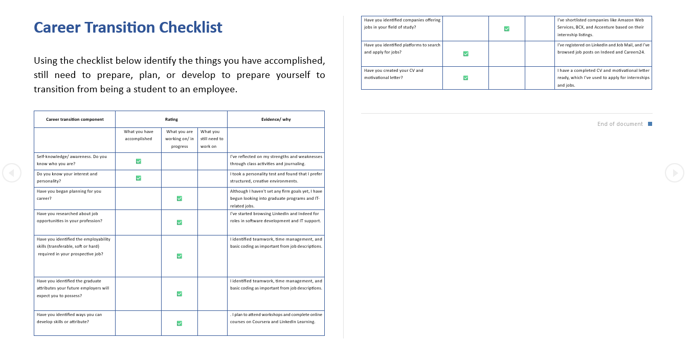
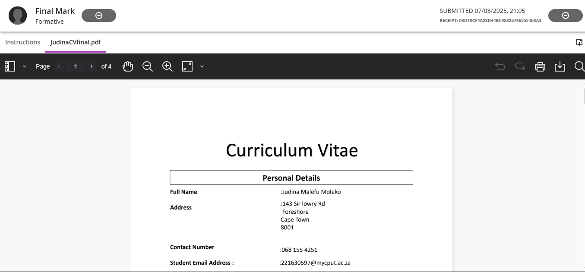

# Work-Readiness-Portfolio

## 1. Career Counselling
** Evidence:** 

###  STAR Reflection  
**S – Situation:** I attended a series of career and personality development workshops.  
**T – Task:** I needed to evaluate my career preparedness and plan for future opportunities.  
**A – Action:** I completed a checklist identifying what I have accomplished and what I still need to work on.  
**R – Result:** I gained clarity on my self-awareness, interests, and current gaps in my career planning process.

## 2. CV Creation
** Evidence:**  
[Download CV](FinalCV.pdf)

 ###  STAR Reflection  
**S – Situation:** I had to prepare a professional CV for internship and job applications.  
**T – Task:** Compile and format a complete CV highlighting my education, experience, and skills.  
**A – Action:** I drafted and revised my CV using templates and feedback from workshops.  
**R – Result:** I now have a finalized CV which I’ve used to apply for internships.
## 3.CV Submission
** Evidence:**  

### 🌟 STAR Reflection  
**S – Situation:** Submitting applications to potential employers was part of my job readiness journey.  
**T – Task:** Upload a polished CV and motivational letter to job portals.  
**A – Action:** I applied through platforms like LinkedIn and Careers24.  
**R – Result:** I received acknowledgments and automated feedback on my application status.

