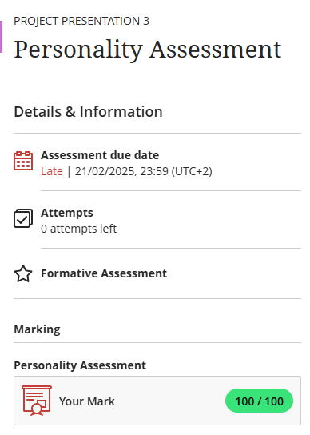

# Work-Readiness-Portfolio

Welcome to my digital portfolio for the Work Readiness Training assessment at Cape Peninsula University of Technology (CPUT).

This portfolio demonstrates my learning and development through various artefacts collected during the training, including career counselling, skills and interests assessments, personality tests, and the creation and submission of my CV.

Each section contains evidence and reflections written using the STAR technique to highlight my growth and readiness for the professional environment.

## 1. Career Counselling
** Evidence:** 

###  STAR Reflection  
**S – Situation:** I attended a series of career and personality development workshops.  
**T – Task:** I needed to evaluate my career preparedness and plan for future opportunities.  
**A – Action:** I completed a checklist identifying what I have accomplished and what I still need to work on.  
**R – Result:** I gained clarity on my self-awareness, interests, and current gaps in my career planning process.

## 2. CV Creation
** Evidence:**  
[Download CV](FinalCV.pdf)

 ###  STAR Reflection  
**S – Situation:** I had to prepare a professional CV for internship and job applications.  
**T – Task:** Compile and format a complete CV highlighting my education, experience, and skills.  
**A – Action:** I drafted and revised my CV using templates and feedback from workshops.  
**R – Result:** I now have a finalized CV which I’ve used to apply for internships.

## 3.CV Submission
** Evidence:**  

### STAR Reflection  
**S – Situation:** Submitting applications to potential employers was part of my job readiness journey.  
**T – Task:** Upload a polished CV and motivational letter to job portals.  
**A – Action:** I applied through platforms like LinkedIn and Careers24.  
**R – Result:** I received acknowledgments and automated feedback on my application status.

## 4. Skills and Interests  
**Evidence:**  

### STAR Reflection  
**S – Situation:** I completed a skills and interests assessment as part of the work readiness programme.  
**T – Task:** Evaluate my skills honestly and align them with potential career options.  
**A – Action:** I assessed my strengths in communication, teamwork, and time management and explored suitable industries.  
**R – Result:** I identified key areas for growth and narrowed down career paths that match my abilities.

## 4. Personality Assessment  
**Evidence:**  

### STAR Reflection  
**S – Situation:** I completed a personality assessment to understand my behavioral traits.  
**T – Task:** Use the insights to improve self-awareness and workplace adaptability.  
**A – Action:** Reflected on my strengths like resilience and challenges like impatience, planning how to address them.  
**R – Result:** Enhanced my ability to work well in teams and approach challenges positively.

